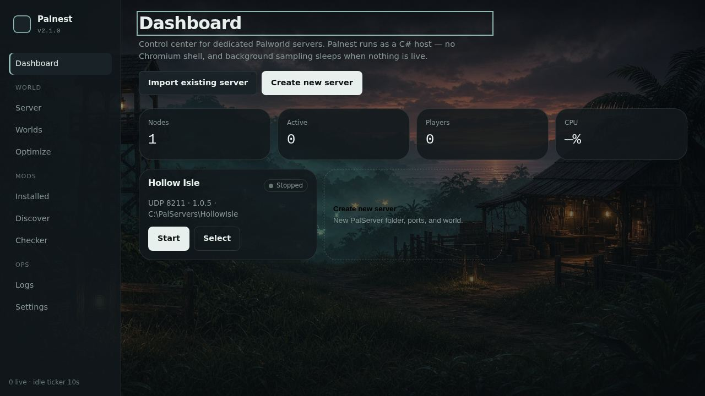

# Palnest — Palworld Server & Mod Manager

Windows desktop app for dedicated Palworld servers, mods, and worlds. **2.2.0**.



## Download (Windows)

- **Installer wizard** — `Palnest-Setup-2.2.0.exe` on the [latest release](https://github.com/Saiki1997/Palnest/releases/latest)
- **Zip** — `Palnest-2.2.0-windows.zip` (unzip and run Palnest.exe)

## What it does

- **Server only / Client only / Server + client** in Settings
- Create or import a PalServer world from the dashboard
- Start / stop PalServer.exe in-app (no extra terminals)
- Start all / stop all / firewall across the fleet
- CPU and RAM charts, players (kick / ban), guilds
- SteamCMD check for later dedicated builds
- Mods: name, id, or store URL → open the pack, pick a file (PAK vs UE4SS vs PalSchema)
- Frameworks: UE4SS and PalSchema
- Tunnels: auto-detect PortWarp and playit.gg
- Monitor, Optimize (heavy / heavy mods / network), backups every 10 min / 1 h / 6 h / 12 h / 1 day
- Background sampling sleeps when nothing is live

Broken packs warn. They do not block start. If PalServer crashes, Palnest names the pack.

## Tests

```
dotnet test Palnest.Tests
```
